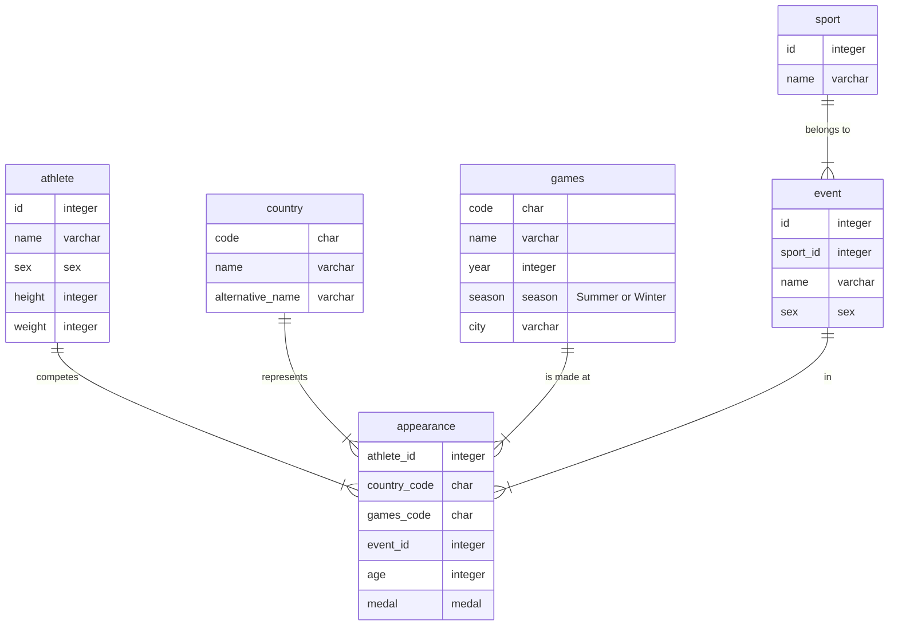

# Sample Olympics Database

This repository contains a sample PostgreSQL database aimed at helping people new to SQL practice.

## Setting up

1. Install PostgreSQL on your computer
  * Mac users can use [Postgres.app](https://postgresapp.com/) or install via [Homebrew](https://wiki.postgresql.org/wiki/Homebrew)
  * Windows users will need adminstrator rights to run it on their computer. There are [detailed instructions on postgresqltutorial.com](https://www.postgresqltutorial.com/postgresql-getting-started/install-postgresql/)
2. Create a database called `olympics`
3. Download the [latest relase](https://github.com/graphia/sql-questions/releases) of the test database and unzip it. You should have a file called `olympics-database.sql`
4. Pipe the database file into your database with `psql olympics < olympics-database.sql`
5. Now you should be able to connect and see some data:

  ```
  olympics=# \dt

  ┌────────┬────────────┬───────┬───────┐
  │ Schema │    Name    │ Type  │ Owner │
  ╞════════╪════════════╪═══════╪═══════╡
  │ public │ appearance │ table │ peter │
  │ public │ athlete    │ table │ peter │
  │ public │ country    │ table │ peter │
  │ public │ event      │ table │ peter │
  │ public │ games      │ table │ peter │
  │ public │ sport      │ table │ peter │
  └────────┴────────────┴───────┴───────┘

  ```

## Schema



## Questions

1. How many gymnastics events are there?
2. When and where were the first Winter Olympic Games?
3. Which athlete taller than 2m has the last name alphabetically?
4. Who is the youngest ever competitor at any games?
5. Which five events have the longest names?
6. Which sports did France win medals at in teh 1952 summer games?
7. Which country won the most biathlon medals between 1990 and 2010?
8. Which sports were included before 1920 but not after?
9. Which ten countries have the most gold medals in table tennis?
10. How many games did Linford Christie compete at?
11. How many athletes have competed at both the summer and winter Olympic games?
